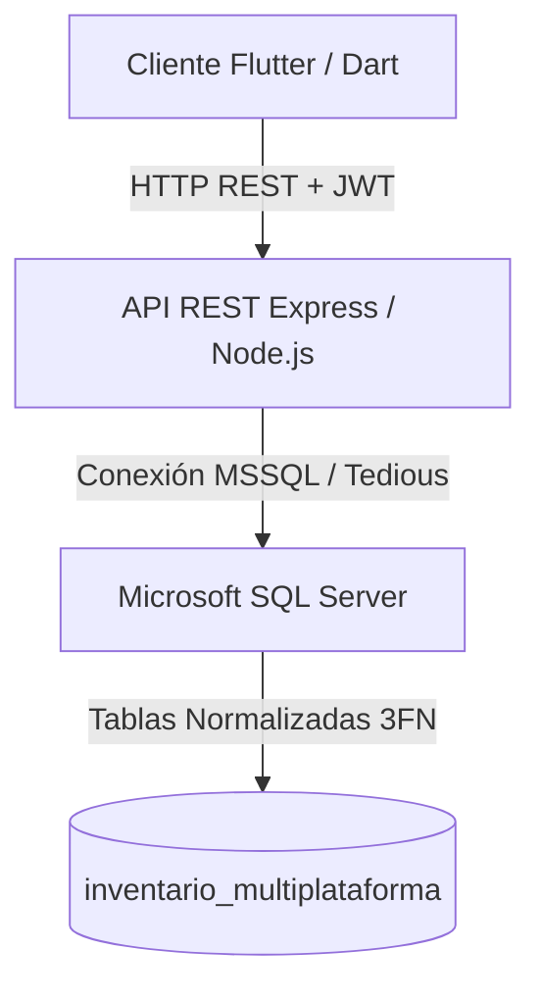

# 📑 Documentación del Sistema ERP StockMaster (Estilo APA 7.ª Edición)

**Referencia Bibliográfica de la Documentación (APA 7):**
> Grupo de Desarrollo 4. (2026). *Manual de arquitectura, especificaciones técnicas y trazabilidad PEPS del sistema ERP StockMaster* (Ed. 3.0). Departamento de Ingeniería de Software, Universidad Tecnológica.

---

## Resumen Ejecutivo

Este documento detalla la estructura arquitectónica y especificaciones técnicas de **StockMaster**, un software de Planificación de Recursos Empresariales (ERP) especializado en el control de almacenes mediante el método de inventarios PEPS (Primero en Entrar, Primero en Salir). Se describen los componentes del frontend multiplataforma en Flutter, el backend RESTful en Node.js y la persistencia relacional en Microsoft SQL Server, analizando el diseño transaccional y las optimizaciones de rendimiento implementadas.

---

## 1. Arquitectura General y Tecnologías

De acuerdo con Sommerville (2011), la arquitectura cliente-servidor de tres capas proporciona escalabilidad, modularidad y separación de responsabilidades. **StockMaster** adopta este patrón distribuyendo sus servicios de la siguiente forma:

### 1.1 Capa de Presentación (Frontend)
Desarrollada en el SDK multiplataforma **Flutter 3.x** utilizando el lenguaje **Dart**. Emplea el patrón de diseño **Provider** para la gestión reactiva del estado (State Management) y la inyección de dependencias, reduciendo el acoplamiento y previniendo la degradación del rendimiento por renderizado innecesario.

### 1.2 Capa de Negocio y Servicios (Backend RESTful)
Construida sobre **Node.js** con el framework **Express**. Esta capa encapsula las reglas de negocio, procesa la autenticación mediante JSON Web Tokens (JWT) y expone endpoints seguros bajo protocolo HTTP.

### 1.3 Capa de Datos (Persistencia Transaccional)
Soportada por **Microsoft SQL Server**. El esquema relacional está normalizado hasta la Tercera Forma Normal (3FN), mitigando redundancias de información y garantizando el cumplimiento de las propiedades **ACID** (Atomacidad, Consistencia, Aislamiento y Durabilidad) mediante el uso estricto de transacciones de base de datos (`BEGIN TRANSACTION`).



---

## 2. Implementación Matemática y Algorítmica del Método PEPS (FIFO)

El método de Primero en Entrar, Primero en Salir (PEPS) establece que las existencias que ingresaron primero al almacén deben ser las primeras en ser consumidas al registrar una salida o venta (Horngren et al., 2012). Esto garantiza que el inventario final quede valorado a los costos de adquisición más recientes, lo cual es fundamental en periodos inflacionarios.

### 2.1 Modelo de Base de Datos para el Control de Lotes
Para la realización matemática de este modelo, se introdujo una entidad relacional denominada `product_lots` (Lotes de Productos), la cual actúa como un registro histórico-físico:

$$Lote = \{ lotId, productId, initialQuantity, currentQuantity, unitCost, entryDate \}$$

Donde:
* $currentQuantity$ es la cantidad remanente en el lote ($0 \le currentQuantity \le initialQuantity$).
* $unitCost$ representa el costo real de adquisición del lote específico, el cual es inalterable en el tiempo.

### 2.2 Algoritmo de Consumo Multi-Lote PEPS (Pseudocódigo)
Cuando se solicita una salida de cantidad $Q_{salida}$ para un producto $P$, el motor de base de datos en SQL Server ejecuta una consulta ordenada de forma cronológica ascendente para consumir las unidades del lote más antiguo al más nuevo:

$$\text{Seleccionar Lotes donde } productId = P \text{ y } currentQuantity > 0 \text{ ordenados por } entryDate \text{ ASC}$$

El algoritmo de consumo opera recursivamente de la siguiente manera:

```
Definir Q_remanente = Q_salida
Para cada lote L en Lotes_Disponibles:
    Si Q_remanente <= 0:
        Terminar bucle
        
    Si L.currentQuantity >= Q_remanente:
        // El lote actual tiene suficientes unidades para cubrir toda la demanda remanente
        Registrar consumo de Lote L con cantidad Q_remanente a costo L.unitCost
        L.currentQuantity = L.currentQuantity - Q_remanente
        Q_remanente = 0
    Sino:
        // El lote actual no cubre la demanda; se consume por completo y se pasa al siguiente
        Registrar consumo de Lote L con cantidad L.currentQuantity a costo L.unitCost
        Q_remanente = Q_remanente - L.currentQuantity
        L.currentQuantity = 0
```

Este algoritmo garantiza la conservación exacta del costo histórico de adquisición y calcula de forma precisa el **Costo Total de Ventas (COGS)** mediante la sumatoria:

$$COGS = \sum_{i=1}^{n} (Q_{consumida\_i} \times CostoUnitario_{lote\_i})$$

---

## 3. Optimización de Rendimiento y Experiencia de Usuario (UX)

La latencia percibida por el usuario influye de forma directa en la usabilidad y la adopción de un software (Nielsen, 1993). Para mitigar el retardo y el lag provocado por solicitudes HTTP redundantes a la API Node.js durante la navegación entre pestañas, se implementó un mecanismo de **Background Fetching (Caché Reactivo)**:

1. **Gestión de Estado Inteligente**: Los controladores `ProductProvider` y `InventoryProvider` actúan como la fuente única de la verdad en memoria.
2. **Evaluación de Estado**: Al inicializarse una pantalla, el proveedor evalúa si sus variables locales ya contienen información de una consulta previa.
3. **Optimización Silent-Fetch (Cero Bloqueo)**:
   * *Escenario A (Primera Carga o Forzada)*: Si la lista de datos está vacía, se activa `_isLoading = true`, bloqueando la pantalla con un spinner estético para asegurar la carga inicial de datos.
   * *Escenario B (Navegación Regular)*: Si la lista ya contiene datos, el sistema presenta inmediatamente los datos en caché (cero espera). Paralelamente, se ejecuta un hilo asíncrono secundario para consultar la API, y al responder el servidor, los datos se actualizan de forma transparente en la interfaz (`notifyListeners()`), eliminando pantallas de carga innecesarias.

---

## 4. Referencias Bibliográficas (Normas APA 7)

* Horngren, C. T., Datar, S. M., & Rajan, M. V. (2012). *Contabilidad de costos: Un enfoque gerencial* (14.ª ed.). Pearson Educación.
* Nielsen, J. (1993). *Usability engineering*. Academic Press.
* Sommerville, I. (2011). *Ingeniería de software* (9.ª ed.). Addison-Wesley.
